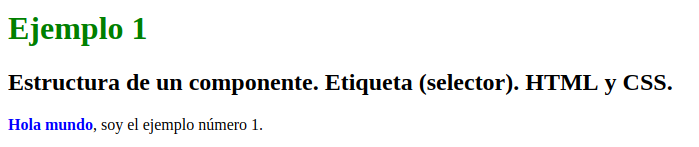
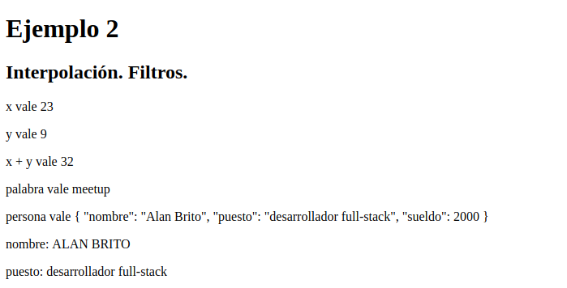
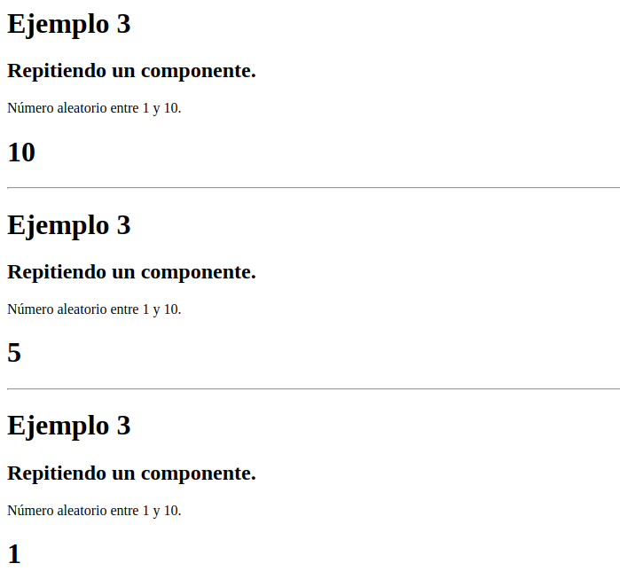
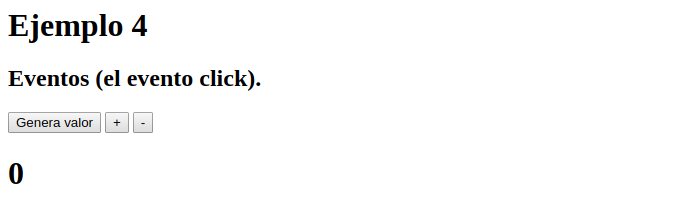
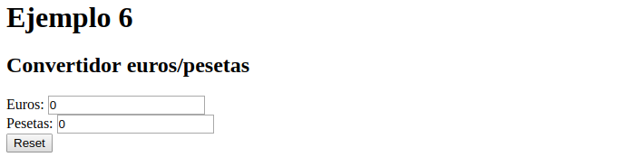
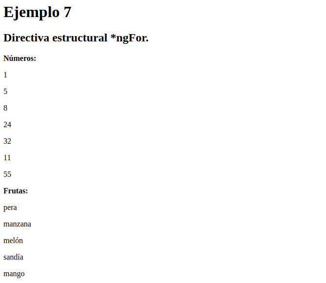
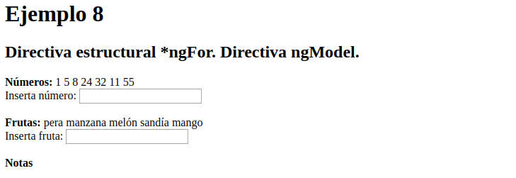
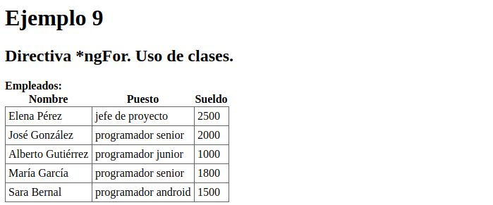
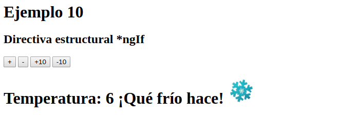

# Iniciación a Angular. Ejemplos.

Para probar los ejemplos de este repositorio, teclea los siguientes comandos:

1. Clona este repositorio en local:

```console
git clone https://github.com/LuisJoseSanchez/iniciacion-a-angular.git
```

2. Entra en el directorio del proyecto:

```console
cd iniciacion-a-angular
```

3. Instala las dependencias:

```console
npm install
```

4. Lanza el servidor para ver la aplicación en http://localhost:4200/:

```console
ng serve
```

La página principal en la que se cargan todos los ejemplos es `app.component.html`:

```html
<app-ejemplo01></app-ejemplo01><hr>
<app-ejemplo02></app-ejemplo02><hr>
<app-ejemplo03></app-ejemplo03><hr>
<app-ejemplo03></app-ejemplo03><hr>
<app-ejemplo03></app-ejemplo03><hr>
<app-ejemplo04></app-ejemplo04><hr>
<app-ejemplo05></app-ejemplo05><hr>
<app-ejemplo06></app-ejemplo06><hr>
<app-ejemplo07></app-ejemplo07><hr>
<app-ejemplo08></app-ejemplo08><hr>
<app-ejemplo09></app-ejemplo09><hr>
<app-ejemplo10></app-ejemplo10><hr>
```

## Ejemplo 1 - Estructura de un componente. Etiqueta (selector). HTML y CSS.

`ejemplo01.component.css`

```css
h1 {
  color: green;
}

b {
  color: blue;
}
```

`ejemplo01.component.html`

```html
<h1>Ejemplo 1</h1>

<h2>Estructura de un componente. Etiqueta (selector). HTML y CSS.</h2>

<p>
  <b>Hola mundo</b>, soy el ejemplo número 1.
</p>
```



## Ejemplo 2 - Interpolación. Filtros.

`ejemplo02.component.html`

```html
<h1>Ejemplo 2</h1>

<h2>Interpolación. Filtros.</h2>

<p>x vale {{ x }}</p>
<p>y vale {{ y }}</p>
<p>x + y vale {{ x + y }}</p>
<p>palabra vale {{ palabra }}</p>
<p>persona vale {{ persona | json}}</p>
<p>nombre: {{ persona.nombre | uppercase }}</p>
<p>puesto: {{ persona.puesto }}</p>
```

`ejemplo02.component.ts`

```typescript
import { Component, OnInit } from '@angular/core';

type Persona = {
  nombre: string;
  puesto: string;
  sueldo: number;
}

@Component({
  selector: 'app-ejemplo02',
  templateUrl: './ejemplo02.component.html',
  styleUrls: ['./ejemplo02.component.scss']
})
export class Ejemplo02Component implements OnInit {

  x: number = 0;
  y: number = 0;
  palabra: string = "";
  persona: Persona = {
    nombre: '',
    puesto: '',
    sueldo: 0
  };

  constructor() { }

  ngOnInit(): void {
    this.x = 23;
    this.y = 9;
    this.palabra = "meetup";
    this.persona = {
      nombre: "Alan Brito",
      puesto: "desarrollador full-stack",
      sueldo: 2000
    };
  }

}
```



## Ejemplo 3 - Repitiendo un componente.

`ejemplo03.component.html`

```html
<h1>Ejemplo 3</h1>

<h2>Repitiendo un componente.</h2>

<p>
  Número aleatorio entre 1 y 10.
</p>

<h1>{{ n }}</h1>
```

`ejemplo03.component.ts`

```typescript
import { Component, OnInit } from '@angular/core';

@Component({
  selector: 'app-ejemplo03',
  templateUrl: './ejemplo03.component.html',
  styleUrls: ['./ejemplo03.component.scss']
})
export class Ejemplo03Component implements OnInit {

  n: number = 0;

  constructor() { }

  ngOnInit(): void {
    this.n = Math.floor(Math.random() * 10 + 1);
  }

}
```



## Ejemplo 4 - Eventos (el evento click).

`ejemplo04.component.html`

```html
<h1>Ejemplo 4</h1>

<h2>Eventos (el evento click).</h2>

<button (click)="generaValor()">Genera valor</button>&nbsp;
<button (click)="incrementaValor()">+</button>&nbsp;
<button (click)="decrementaValor()">-</button>

<h1>{{ n }}</h1>
```

`ejemplo04.component.ts`

```typescript
import { Component, OnInit } from '@angular/core';

@Component({
  selector: 'app-ejemplo04',
  templateUrl: './ejemplo04.component.html',
  styleUrls: ['./ejemplo04.component.scss']
})
export class Ejemplo04Component implements OnInit {

  n: number = 0;

  constructor() { }

  ngOnInit(): void {
  }

  generaValor() {
    this.n = this.n = Math.floor(Math.random() * 10 + 1);
  }

  incrementaValor() {
    this.n++;
  }

  decrementaValor() {
    this.n--;
  }
}
```



## Ejemplo 5 - Entrada de datos con "input"

Para el enlazado bidireccional (*double binding*) se utiliza `ngModel` y, a su vez, para poder utilizar `ngModel` es necesario importar `FormsModule` en el archivo `app.module.ts` y añadirlo a `imports`.

`app.module.ts`

```typescript
import { NgModule } from '@angular/core';
import { FormsModule } from '@angular/forms';
import { BrowserModule } from '@angular/platform-browser';

...

@NgModule({

...

  imports: [
    BrowserModule,
    FormsModule
  ],
  providers: [],
  bootstrap: [AppComponent]
})
export class AppModule { }
```

`ejemplo05.component.html`

```html
<h1>Ejemplo 5</h1>

<h2>Entrada de datos con "input"</h2>

<input type="text" [(ngModel)]="palabra">

<button (click)="limpiaTexto()">Reset</button>

<h1>{{ palabra | uppercase }}</h1>
```

`ejemplo05.component.ts`

```typescript
import { Component, OnInit } from '@angular/core';

@Component({
  selector: 'app-ejemplo05',
  templateUrl: './ejemplo05.component.html',
  styleUrls: ['./ejemplo05.component.scss']
})
export class Ejemplo05Component implements OnInit {

  palabra: string = "";

  constructor() { }

  ngOnInit(): void {
  }

  limpiaTexto() {
    this.palabra = "";
  }
}
```


## Ejemplo 6 - Convertidor euros/pesetas.

`ejemplo06.component.html`

```html
<h1>Ejemplo 6</h1>

<h2>Convertidor euros/pesetas</h2>

Euros:
<input
  [(ngModel)]="euros"
  (keyup)="actualizaPesetas()">
<br>

Pesetas:
<input
  [(ngModel)]="pesetas"
  (keyup)="actualizaEuros()">
<br>

<button (click)="limpia()">Reset</button>
```

`ejemplo06.component.ts`

```typescript
import { Component, OnInit } from '@angular/core';

@Component({
  selector: 'app-ejemplo06',
  templateUrl: './ejemplo06.component.html',
  styleUrls: ['./ejemplo06.component.scss']
})
export class Ejemplo06Component implements OnInit {

  euros: number = 0;
  pesetas: number = 0;

  constructor() { }

  ngOnInit(): void {
  }

  limpia() {
    this.euros = 0;
    this.pesetas = 0;
  }

  actualizaPesetas() {
    this.pesetas = this.euros * 166.386;
  }

  actualizaEuros() {
    this.euros = this.pesetas / 166.386;
  }
}
```



## Ejemplo 7 - Directiva estructural *ngFor.

`ejemplo07.component.html`

```html
<h1>Ejemplo 7</h1>

<h2>Directiva estructural *ngFor.</h2>

<b>Números:</b>
<p
  *ngFor="let n of numeros">
  {{ n }}
</p>

<b>Frutas:</b>
<p
  *ngFor="let f of frutas">
  {{ f }}
</p>

```

`ejemplo07.component.ts`

```typescript
import { Component, OnInit } from '@angular/core';

@Component({
  selector: 'app-ejemplo07',
  templateUrl: './ejemplo07.component.html',
  styleUrls: ['./ejemplo07.component.scss']
})
export class Ejemplo07Component implements OnInit {

  numeros: number[] = [];
  frutas: string[] = [];

  constructor() { }

  ngOnInit(): void {
    this.numeros = [1, 5, 8, 24, 32, 11, 55];
    this.frutas = ["pera", "manzana", "melón", "sandía", "mango"];
  }

}
```



## Ejemplo 8 - Directiva estructural *ngFor.

`ejemplo08.component.html`

```html
<h1>Ejemplo 8</h1>

<h2>Directiva estructural *ngFor. Directiva ngModel.</h2>

<b>Números:</b>
<span
  *ngFor="let n of numeros">
  {{ n }}
</span>

<br>

Inserta número:
<input [(ngModel)]="numero"  (keyup.enter)="insertaNumero()" type="text">

<br><br>

<b>Frutas:</b>
<span
  *ngFor="let f of frutas">
  {{ f }}
</span>

<br>

Inserta fruta:
<input [(ngModel)]="fruta"  (keyup.enter)="insertaFruta()" type="text">
```

`ejemplo08.component.ts`

```typescript
import { Component, OnInit } from '@angular/core';

@Component({
  selector: 'app-ejemplo08',
  templateUrl: './ejemplo08.component.html',
  styleUrls: ['./ejemplo08.component.scss']
})
export class Ejemplo08Component implements OnInit {

  numeros: number[] = [];
  frutas: string[] = [];

  numero: number = 0;
  fruta: string = '';

  constructor() { }

  ngOnInit(): void {
    this.numeros = [1, 5, 8, 24, 32, 11, 55];
    this.frutas = ["pera", "manzana", "melón", "sandía", "mango"];
  }

  insertaNumero() {
    this.numeros.push(this.numero);
    this.numero = 0; // limpia el input
  }

  insertaFruta() {
    this.frutas.push(this.fruta);
    this.fruta = ''; // limpia el input
  }
}
```



## Ejemplo 9 - Directiva *ngFor. Uso de clases.

`empleado.ts`

```typescript
export class Empleado {
  nombre: string;
  puesto: string;
  sueldo: number;
}
```

`lista-empleados.ts`

```typescript
import { Empleado } from "./empleado";

export const listaEmpleados: Empleado[] = [
  {
    nombre: 'Elena Pérez',
    puesto: 'jefe de proyecto',
    sueldo: 2500
  },
  {
    nombre: 'José González',
    puesto: 'programador senior',
    sueldo: 2000
  },
  {
    nombre: 'Alberto Gutiérrez',
    puesto: 'programador junior',
    sueldo: 1000
  },
  {
    nombre: 'María García',
    puesto: 'programador senior',
    sueldo: 1800
  },
  {
    nombre: 'Sara Bernal',
    puesto: 'programador android',
    sueldo: 1500
  }
  
];
```

`ejemplo09.component.css`

```css
table {
  border-collapse: collapse;
}

td {
  border: 1px solid #666;
  padding: 4px;
}
```

`ejemplo09.component.html`

```html
<h1>Ejemplo 9</h1>

<h2>Directiva *ngFor. Uso de clases.</h2>

<b>Empleados:</b>
<table>
  <tr>
    <th>Nombre</th><th>Puesto</th><th>Sueldo</th>
  </tr>
  <tr *ngFor="let e of empleados">
    <td>{{ e.nombre }}</td>
    <td>{{ e.puesto }}</td>
    <td>{{ e.sueldo }}</td>
  </tr>
</table>
```

`ejemplo09.component.ts`

```typescript
import { Component, OnInit } from '@angular/core';
import { Empleado } from '../empleado';
import { listaEmpleados } from '../lista-empleados';

@Component({
  selector: 'app-ejemplo09',
  templateUrl: './ejemplo09.component.html',
  styleUrls: ['./ejemplo09.component.css']
})
export class Ejemplo09Component implements OnInit {

  empleados: Empleado[];

  constructor() {
    this.empleados = listaEmpleados;
  }

  ngOnInit() {
  }

}
```



## Ejemplo 10 - Directiva estructural *ngIf

`ejemplo10.component.html`

```html
<h1>Ejemplo 10</h1>

<h2>Directiva estructural *ngIf</h2>

<button (click)="incrementaValor(1)">+</button>
<button (click)="incrementaValor(-1)">-</button>
<button (click)="incrementaValor(10)">+10</button>
<button (click)="incrementaValor(-10)">-10</button>

<h1>
  
Temperatura: {{ temperatura }}

<ng-container *ngIf="temperatura > 40">
  ¡Qué calor!
  
</ng-container>

<ng-container *ngIf="temperatura < 10">
  ¡Qué frío hace!
  
</ng-container>

</h1>
```

`ejemplo10.component.ts`

```typescript
import { Component, OnInit } from '@angular/core';

@Component({
  selector: 'app-ejemplo10',
  templateUrl: './ejemplo10.component.html',
  styleUrls: ['./ejemplo10.component.css']
})
export class Ejemplo10Component implements OnInit {

  temperatura;

  constructor() { }

  ngOnInit() {
    this.temperatura = Math.floor(Math.random() * 20 + 1);
  }

  incrementaValor(incremento: number) {
    this.temperatura += incremento;
  }
}
```


